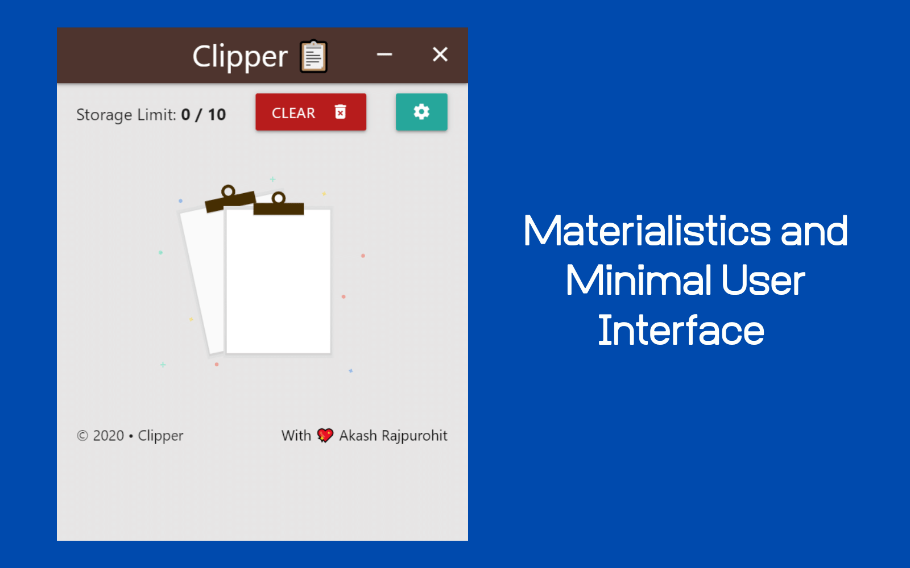
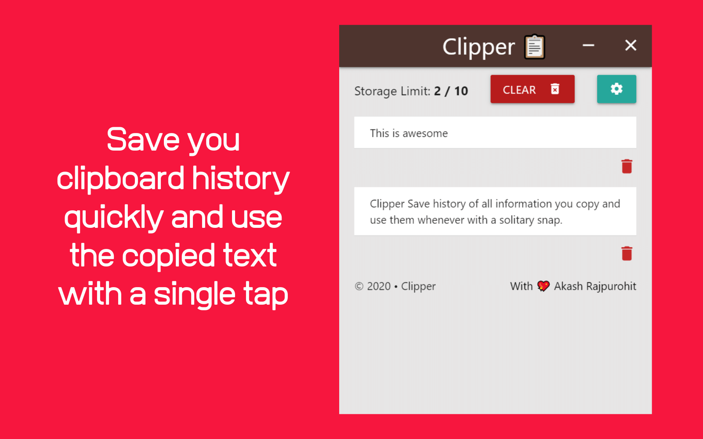
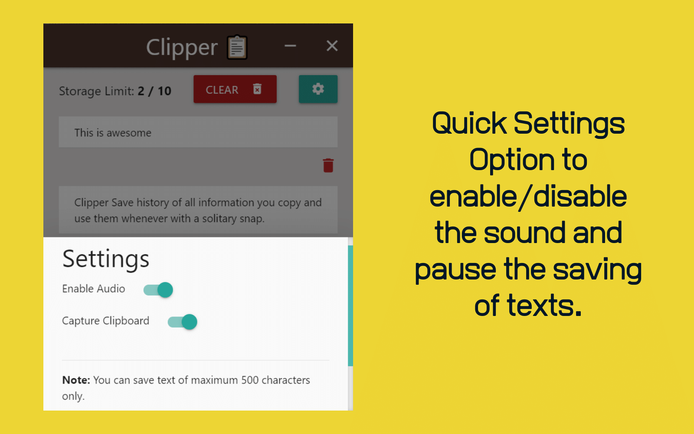

  
<h1 align="center"> Clipper </h1>  

   Save history of all information you copy and use them whenever with a solitary snap.

      

## 🙌 Features
* Save history of any text copied on the system clipboard.
* Click on the any text from history to write it to the system clipboard.
* Clear a single text
* Trash all copied text at once
* Limit on storage
* Audio for events
    * When text gets copied
    * Any error triggered like storage limit exceeded
    * Clearing storage
* Settings Tab
    * Disable/Enable Sound
    * Disable/Enable Clipboard Copying (Just in case you want to copy everything all the time)

## Screenshots
Main Screen                    | List of copied text     | Settings
:-----------------------------:|:-----------------------:|:--------------:
  |   | 

## 📥 Download
Clipper is available for Windows & Linux and can be downloaded from Github releases.

[https://github.com/AkashRajpurohit/clipper/releases](https://github.com/AkashRajpurohit/clipper/releases)

## ❓ FAQs
1. Tray icon does not show up in linux?

> Install [App Indicator](https://extensions.gnome.org/extension/615/appindicator-support/) for Gnome Tweak tools.

## 💵 Support
> If you found this project helpful or you learned something from the source code and want to thank me, consider buying me a cup of :coffee:

## 🐛 Bugs or Requests

If you encounter any problems feel free to open an [issue](https://github.com/AkashRajpurohit/clipper/issues/new?template=bug_report.md). If you feel the library is missing a feature, please raise a [ticket](https://github.com/AkashRajpurohit/clipper/issues/new?template=feature_request.md) on GitHub and I'll look into it. Pull request are also welcome.

## Where to find me?
* [Website](https://akashwho.codes/)
* [Linkedin](https://www.linkedin.com/in/AkashRajpurohit)
* [Instagram](https://www.instagram.com/akashwho.codes)
* [Twitter](https://www.twitter.com/AkashWhoCodes)
